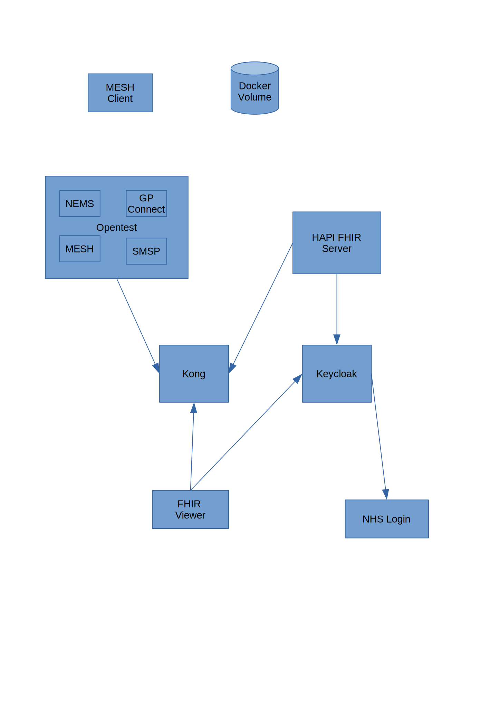

# Project Enormous

An NHS Ecosystem and LHCR development environment.

Project enormous is a set of docker containers providing two environments configured to provide easy demonstration and development of a number of NHS and LHCR technologies.

Each of the 2 LHCR environments provides:

* A HAPI FHIR Server configured with Open ID Connect and Smart on FHIR Scope support.
* A FHIR test viewer based on the HAPI FHIR Test overlay. It allows viewing of data in OIDC protected FHIR servers and the use OAUTH Token exchange to view data from other FHIR servers.
* A Kong API Gateway configured to provide access to the FHIR Server APIs and to proxy requests to services in the NHS OpenTest environment.
* A Keycloak server configured to support OAUTH Token Exchange and simple use of FHIR Smart Scopes. 



## Prerequisites

All services used in the images are built using docker build chains so the only requirements to run the environment are:

* Docker and docker-compose installed an working
* To use the OpenTest proxy you must have an account for OpenTest. The OpenVPN configuration file should be copied to:  

    `configs/opentest/`

* The hosts `lhcr1` and `lhcr2` added to your local hosts file and mapped to localhost:

```
127.0.0.1 lhcr1
127.0.0.1 lhcr2
```

## Starting the environment

Before running he build script you need to set the environment variable IP to the ip address of the local machine - this is used by the docker containers so must be the host ip not the local ip. e.g:

`export IP=192.168.0.30`

This varaible is used to set up the hosts in the docker containers.

To start both lhcr1 and lhcr2 run the script: `build-env.sh`
To start lhcr1 run the script: `build-lhcr1.sh`
To start lhcr2 only, run the script: `build-lhcr2.sh`

## Network Details 

## LHCR one

| Service | Docker Host | Docker Port | Host Port|
|---------|-------------|-------------|-----------|
| Keycloak Backend | lhcr1-keycloak | 8080 | N/A|
| Keycloak Frontend | lhcr1-keycloak | 8081 | 8081|  
| Kong API Endpoints | lhcr1-kong | 8000 | 8000 | 
| Kong Secure API Endpoints | lhcr1-kong | 8443 | 8443 |
| Kong Admin | lhcr1-kong | 8001 | 8001|
| Kong Secure Admin | lhcr1-kong | 8444 | 8444 |
| Postgres   | lhcr1-kong-db | 5432 | 6431|
| FHIR Server| lhcr1-fhirserver | 8080 | N/A** |
| FHIR Viewer | lhcr1-viewer | 9090 | 9090 |

** Service accesed via Kong

### LHCR two

| Service | Docker Host | Docker Port | Host Port|
|---------|-------------|-------------|-----------|
| Keycloak Backend | lhcr2-keycloak | 8080 | N/A| 
| Keycloak Frontend | lhcr2-keycloak | 8081 | 8082| 
| Kong API Endpoints | lhcr2-kong | 8000 | 8002|
| Kong Secure API Endpoints | lhcr2-kong | 8443 | 8445|
| Kong Admin | lhcr2-kong | 8001 | 8004 |
| Kong Secure Admin | lhcr2-kong | 8444 | 8446 |
| Postgres   | lhcr2-kong-db | 5432 | 6432 |
| FHIR Server| lhcr2-fhirserver | 8080 | N/A** |
| FHIR Viewer | lhcr2-viewer | 9090 | 9091 |

** Service accesed via Kong

## Kong Proxy Paths
| Service | Path | Auth
|-----|-----|----|
| FHIR Server | /fhir | OAUTH Introspection or OIDC with encrypted cookie
| OpenTest NEMS** | /nems | None/Pass-through
| OpenTest MESH API** | /meshapi | None/Pass-through
| OpenTest SMSP** | /smsp | None/Pass-through
| OpenTest GPConnect 0.x| /gpconnect0  | None/Pass-through
| OpenTest GPConnect 1.x| /gpconnect1  | None/Pass-through
| OpenTest Spine Security Proxy| /spinesp  | None/Pass-through


** LHCR1 Only

## Keycloak users

### Lhcr1

| User | Password | Role | Smart Scope
|------|----------|-----|----
| user1| user1    | clinical | \*.*

### Lhcr2

| User | Password | Role| Smart Scope
|------|----------|-----|-----
| user2| user2    | clinical | \*.*

## Keycloak Clients

### Lhcr1

b2c55a04-3ac4-4545-bb0c-da063b9e4a9e

| ClientID | Client Secret | Use
|------|----------|-----
| kong| 0efb256c-cdb9-439b-9767-c6b997a4e827 | Used by API gateway to authenticate requests
| testviewer| 85ac8b3e-df3c-4e4f-be65-ca5e5b68d3dc | Used by the FHIR Test Viewer to authenticate user
| lhcr2_keycloak| fdfb428e-6415-4073-8bc8-32a1a2061067 | Used by the LHCR2 Keycloak to access Userinfo endpoint
| lhcr2_testviewer| a4d8acc4-48ba-46fe-a46a-99a7bf6bb8fe | Used by the LHCR2 FHIR Test Viewer to exchange a token

### Lhcr2
| ClientID | Client Secret | Use
|------|----------|-----
| kong| b2c55a04-3ac4-4545-bb0c-da063b9e4a9e| Used by API gateway to authenticate requests
| testviewer| 5244c131-ae37-4b37-a015-c4d1e587034a | Used by the FHIR Test Viewer to authenticate user
| lhcr1_keycloak| 7193c27b-e93c-459a-91b7-fc91abb464a2 | Used by the LHCR1 Keycloak to access Userinfo endpoint
| lhcr1_testviewer| 91568b49-bb6d-4197-90f7-132e9db5fe16 | Used by the LHCR1 FHIR Test Viewer to exchange a token

## Export the Keycloak config

bin/standalone.sh -Dkeycloak.migration.usersExportStrategy=SAME_FILE -Dkeycloak.migration.action=export -Dkeycloak.migration.provider=singleFile -Dkeycloak.migration.realmName=lhcr1 -Dkeycloak.migration.file=keycloak-export.json -Djboss.http.port=8888 -Djboss.https.port=9999 -Djboss.management.http.port=7777
