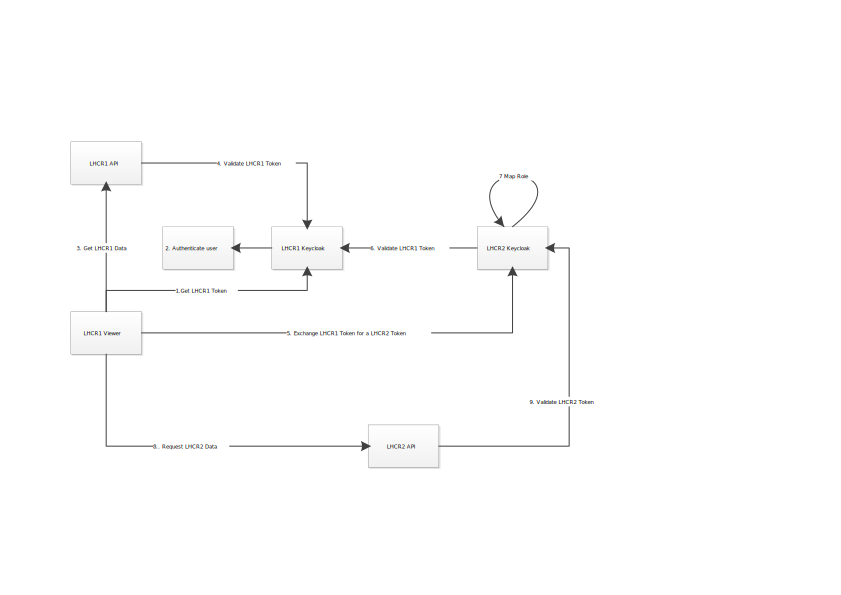

# Token Exchange/Cross Record Access

Project Enourmous can be used to demonstrate and experiment with OAUTH Token Exchange.

OAUTH 2.0 Token exchange is formaly documented here:

[https://tools.ietf.org/html/rfc8693](https://tools.ietf.org/html/rfc8693])

ProjectEnormous includes a pair of Keycloak instances pre-conifugred to support token exchange.

Within ProjectEnormous the flow is as follows:

| Step | Description | Diagram Step
|---------|-------------|-------------|
| Attempt Login to LHCR2 | Navigate to the LHCR2 Viewer at http://lhcr2:9990. You will be redirected to the LHCR2 Keycloak login page. Attempt login with username: user1 and password user1. Login will fail as user1 does not exist in LHCR2 | N/A |
| Access to LHCR1 viewer | Navigate to the LHCR2 Viewer at http://lhcr1:9990. You will be redirected to the LHCR1 Keycloak login page. | 1 |
| Authenticate to LHCR1 | Login with username: user1 and password: user1. | 2 |
| Access LHCR1 data | Use the viewer to access data held in the LHCR1 FHIR server. The API server validates the token with the LHCR1 Keycloak instance. | 3 and 4 |
| View the LHCR1 Token | In the top right "About" menu you can select "View token". This is the decoded token issued by the LHCR1 Keycloak | N/A |
| Switch viewer to LHCR2 | In the top right "Server" menu select "Remote LHCR". The viewer connects to the LHCR2 Keycloak instance and requests a LHCR2 Token in exchange for a LHCR1 token | 5 |
| LHCR2 Validates LHCR1 token | In the top right "Server" menu select "Remote LHCR". The viewer connects to the LHCR2 Keycloak instance and requests a LHCR2 Token in exchange for a LHCR1 token | 6 |
| LHCR2 issues token | LHCR2 maps a set of roles to a token (see below) and issues it to the viewer | 7
| LHCR1 user access LHCR2 data | The LHCR1 user is able to access the LHCR2 API. | 8

